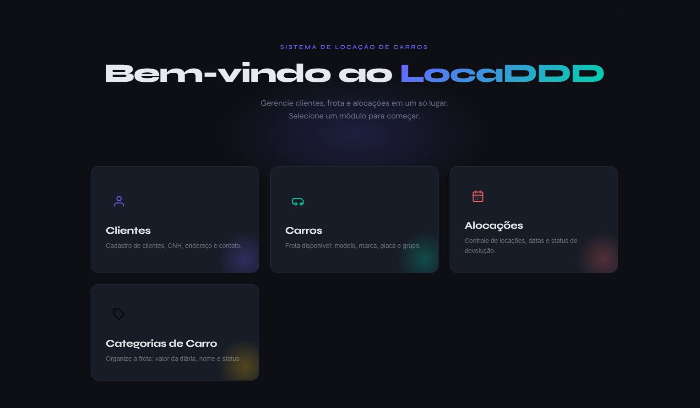

# 🚗 LocaDDD - Backend (ASP.NET Core)

[](https://azure.microsoft.com)
[](https://dotnet.microsoft.com/)
[](https://www.postgresql.org/)
[](https://docker.com)

**API RESTful do sistema de locação de veículos LocaDDD** – construída com **ASP.NET Core 8** e seguindo os princípios do **Domain-Driven Design (DDD)**. Responsável por toda a lógica de negócio, validações, persistência e exposição de endpoints para o frontend.

> 🔗 **Frontend em produção (Vercel):** [https://locadora-ddd-front-react.vercel.app/](https://locadora-ddd-front-react.vercel.app/)  
> 🔗 **Repositório do Frontend (React + Vite):** [andre-monar/locadora-ddd-front-react](https://github.com/andre-monar/locadora-ddd-front-react)



---

## ✨ Funcionalidades da API

- **CRUD completo** de Clientes, Carros, Categorias e Alocações
- **Regras de negócio ricas** (disponibilidade de carros, cálculo automático de valor total, validação de CPF/CNH/placa, impedimento de exclusão de entidades com vínculos ativos)
- **Validações centralizadas** com `Notifies` e retorno padronizado de erros
- **Endpoints específicos** (listar carros disponíveis, dar baixa em alocação, cancelar alocação)
- **CORS configurado** para comunicação com o frontend (Vercel)
- **Swagger** para documentação interativa da API
- **Dockerfile + Docker Compose** – ambiente completo com API, PostgreSQL e pgAdmin
- **CI/CD** – deploy automático no **Azure App Service** a cada push na branch `main`
- **Banco de dados PostgreSQL** na Azure (via connection string configurável)

## 🛠️ Tecnologias & Infraestrutura

| Camada            | Tecnologias                                                                 |
|-------------------|-----------------------------------------------------------------------------|
| **Runtime**       | .NET 8                                                                      |
| **Web API**       | ASP.NET Core (controllers, roteamento, injeção de dependência)              |
| **ORM / Acesso**  | Entity Framework Core 8 (com PostgreSQL)                                   |
| **Banco de dados**| PostgreSQL 16 (hospedado na Azure)                                          |
| **Validações**    | Fluent API + validações customizadas com `Notifies`                         |
| **Documentação**  | Swagger / OpenAPI                                                           |
| **Container**     | Docker + Docker Compose                                                     |
| **Deploy**        | Azure App Service + CI/CD (GitHub Actions)                                  |
| **Arquitetura**   | Domain-Driven Design (DDD) com separação total das camadas                  |

---

## 🏛️ Estrutura do Projeto (DDD)

O repositório está organizado em **5 camadas** independentes, seguindo os conceitos de DDD e **Clean Architecture**:

```
📁 LocadoraDDD/
├── 1 - Presentation/
│ └── LocadoraWebAPI/ # Controllers, DTOs, Swagger, Program.cs
├── 2 - Application/
│ ├── Interfaces/ # IAlocacaoApp, ICarroApp, ...
│ └── OpenApp/ # Implementações (AlocacaoApp, CarroApp, ...)
├── 3 - Domain/
│ ├── Interfaces/ # Repositórios específicos (IAlocacao, ICarro...)
│ ├── Services/ # Regras de negócio (AlocacaoService, CarroService...)
│ └── Entities/ # Entidades de domínio (Alocacao, Carro, Cliente...)
├── 4 - Infrastructure/
│ ├── Configuration/ # DbContext, migrations
│ ├── Repository/ # Implementações concretas dos repositórios
│ └── Generics/ # GenericRepository<T>
└── 5 - Entities/ # Notificações, Enums, validações (camada compartilhada)
```

### 🧭 Fluxo da requisição (DDD na prática)
Exemplo -> POST de um carro:
```
1. POST /api/Carro (JSON com Modelo, Placa...)
         ↓
2. CarroController.Criar(CriarCarroDto)
   → cria objeto Carro (entidade)
   → chama _carroApp.Adicionar(carro)
         ↓
3. CarroApp.Adicionar(carro)  ← Application layer
   → chama _service.AddCarro(carro)  ← chama Domain Service
         ↓
4. CarroService.AddCarro(carro)  ← Domain layer
   → ValidarCarro(carro):
        • carro.ValidarPlaca()  ← método na própria entidade!
        • carro.ValidarString()  ← método na entidade!
        • await _ICarro.PlacaJaExiste()  ← verifica no repo
        • await _ICategoriaCarro.GetEntityById()  ← busca categoria
   → Se tudo ok, _ICarro.Add(carro)  ← chama repository
         ↓
5. CarroRepository.Add(carro)  ← Infrastructure layer
   → _context.Set<Carro>().AddAsync(carro)
   → _context.SaveChangesAsync()
         ↓
6. PostgreSQL → insere na tabela TB_CARRO
```


---

## 🖥️ Como executar localmente

### Pré‑requisitos
- [.NET 8 SDK](https://dotnet.microsoft.com/download/dotnet/8.0)
- Docker e Docker Compose (recomendado) **ou** PostgreSQL instalado localmente

### Opção 1: Usando Docker Compose 

1. **Clone o repositório**
   ```bash
   git clone https://github.com/andre-monar/locadora-ddd-back-dotnet.git
   cd locadora-ddd-back-dotnet
   ```
2. **Suba o ambiente completo (API + PostgreSQL + pgAdmin)**
   ```bash
   docker-compose up -d
   ```
3. **Aguarde o banco iniciar e as migrations rodarem automaticamente (configurado no Program.cs para aplicar migrations no startup em Development).
4. **Acesse:**
   - API Swagger: http://localhost:8080/swagger
   - pgAdmin: http://localhost:5050 (e-mail: admin@locadora.com | senha: admin)
5. **Para parar o ambiente:**
   ```bash
   docker-compose down
   ```

### Opção 2: Sem Docker (API + PostgreSQL local)
1. **Instale e inicie o PostgreSQL**
2. **Configure a connection string no `appsettings.json`:
   ```bash
   {
     "ConnectionStrings": {
       "DefaultConnection": "Host=localhost;Port=5432;Database=locadora;Username=postgres;Password=sua_senha"
     }
   }
   ```
3. **Rode as migrations:**
   ```bash
   dotnet ef database update --project LocadoraWebAPI
   ```
4. **Execute a API:**
   ```bash
   dotnet run --project LocadoraWebAPI/LocadoraWebAPI.csproj
   ```
5. **Acesse:** http://localhost:5000/swagger

## 🐳 Docker Compose em detalhe

O arquivo `docker-compose.yml` sobe três serviços:

| Serviço | Função | Porta (host:container) |
|---------|--------|------------------------|
| `postgres` | Banco de dados PostgreSQL 16 | `5432:5432` |
| `pgadmin` | Interface gráfica do PostgreSQL | `5050:80` |
| `webapi` | API .NET 8 (build local) | `8080:8080` |

**Variáveis de ambiente importantes para a API:**

```yaml
environment:
  - ASPNETCORE_ENVIRONMENT=Development
  - ConnectionStrings__DefaultConnection=Host=postgres;Port=5432;Database=locadora;Username=postgres;Password=1234
```
Com isso, a API já se conecta ao banco postgres pelo nome do serviço (resolução automática dentro da rede Docker).

> ⚠️ Nota: O Dockerfile está em `LocadoraWebAPI/Dockerfile` – o compose faz o build automaticamente a partir da raiz do projeto.

---

## ☁️ Deploy na Azure (CI/CD)

- **Compute:** Azure Container Apps (`calocadora`)
- **Registry:** Azure Container Registry (`acrlocadora`)
- **Database:** Azure Database for PostgreSQL - Flexible Server (`pg-locadora`)

O CI/CD (GitHub Actions) constrói a imagem Docker, envia para o ACR e atualiza o Container App automaticamente a cada push na `master`.

---

## 🔌 Endpoints da API

| Método | Endpoint | Descrição |
|--------|----------|-----------|
| **Clientes** |||
| GET | `/api/Cliente` | Lista todos os clientes |
| POST | `/api/Cliente` | Cria um novo cliente |
| PUT | `/api/Cliente/{id}` | Atualiza um cliente |
| DELETE | `/api/Cliente/{id}` | Remove um cliente |
| **Carros** |||
| GET | `/api/Carro` | Lista todos os carros (com categoria) |
| GET | `/api/Carro/disponiveis` | Lista apenas carros disponíveis |
| POST | `/api/Carro` | Cadastra um carro |
| PUT | `/api/Carro/{id}` | Atualiza um carro |
| DELETE | `/api/Carro/{id}` | Remove um carro |
| **Categorias de Carro** |||
| GET | `/api/CategoriaCarro` | Lista todas as categorias |
| POST | `/api/CategoriaCarro` | Cria uma categoria |
| PUT | `/api/CategoriaCarro/{id}` | Atualiza categoria |
| DELETE | `/api/CategoriaCarro/{id}` | Remove categoria |
| **Alocações** |||
| GET | `/api/Alocacao` | Lista todas as alocações (com carro e cliente) |
| POST | `/api/Alocacao` | Cria uma nova alocação |
| PUT | `/api/Alocacao/{id}` | Atualiza uma alocação |
| DELETE | `/api/Alocacao/{id}` | Remove uma alocação |
| PUT | `/api/Alocacao/{id}/baixa` | Registra a devolução do carro |
| PUT | `/api/Alocacao/{id}/cancelar` | Cancela uma alocação ativa |
| **Status** |||
| GET | `/api/AlocacaoStatus` | Retorna lista de status possíveis (1-Ativo, 2-Retornado, 3-Cancelado) |

> Todos os endpoints seguem o padrão de retorno da `BaseApiController` (200, 201, 400, 404).

---

## 🧪 Testes e validações

A camada de domínio conta com validações robustas:

- CPF, placa (padrão Mercosul e antigo), celular, e‑mail

**Regras de negócio:**

- Cliente deve ter 18 anos ou mais
- Carro só pode ser alocado se estiver **ativo** e **disponível**
- Carro só pode ser inativado se não houver alocações ativas
- Categoria só pode ser inativada se não houver carros ativos vinculados
- Exclusão de entidades só permitida se não houver vínculos (alocações ou carros)
- Valor total da alocação é calculado automaticamente na devolução
- Alteração de carro em uma alocação verifica disponibilidade do novo veículo

Todas as regras são implementadas nos **Domain Services** e os erros são retornados no formato padronizado:

```json
{
  "erros": [
    { "campo": "Placa", "mensagem": "Placa já cadastrada" }
  ]
}
```

---
### 🎓 Inspiração

Este projeto foi adaptado do curso **"Criando um E‑commerce com DDD + .NET Core"** do canal [DEV NET CORE Valdir Ferreira](https://www.youtube.com/watch?v=pGumMsnszkM&list=PLP8qOphXwRnIqrLjD3KlaWRj2a4HJmYhu) – que apresenta uma implementação sólida de DDD com separação de responsabilidades, serviços de domínio e notificações.
